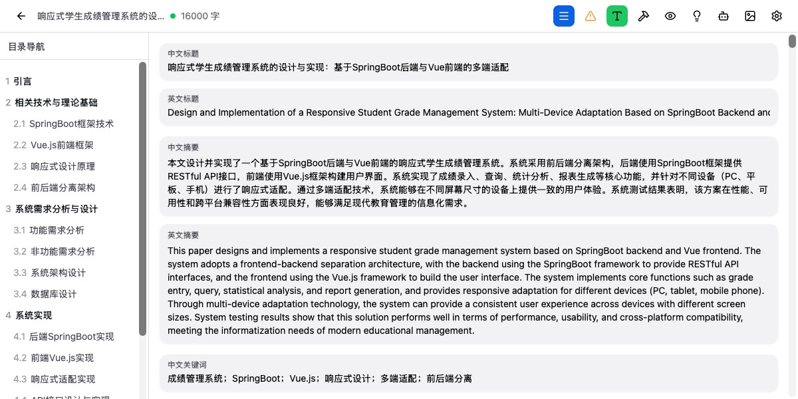
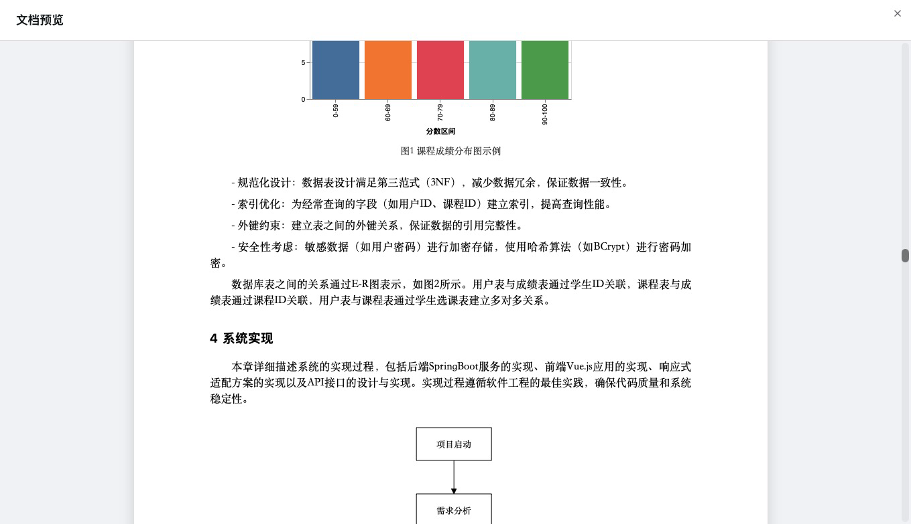

# 🎓 Agper

**AI 驱动的学术论文写作助手**

*从选题到成稿，AI 全程辅助的学术论文写作桌面应用*

[📥 下载最新版本](https://github.com/AI-NoDev/agper-report/releases/latest)

---

## 📸 软件截图

### 主编辑界面

*结构化文档编辑器，支持目录导航、实时预览、AI 助手侧边栏*

---

### AI 智能写作

*AI 助手实时辅助写作，支持扩写、润色、缩写等操作*

---

### 文献搜索与引用

*自动搜索知网、arXiv 等学术数据库，一键插入 GB/T 7714 格式引用*

---

### 图表生成工具

*用自然语言描述生成专业图表，支持折线图、柱状图、饼图等*

---

### 论文工具箱

*丰富的论文写作辅助工具：大纲生成、摘要撰写、公式编辑、流程图等*

---

## ✨ 核心功能

### 🤖 AI 智能写作

| 功能 | 描述 |
|------|------|
| **智能选题助手** | AI 帮助生成和优化研究课题，分析研究空白 |
| **大纲自动生成** | 根据论文主题自动生成符合学术规范的章节结构 |
| **分章节写作** | AI 辅助撰写每个章节，保持学术风格和逻辑连贯 |
| **内容扩写/缩写** | 选中段落一键扩写或精简，智能调整篇幅 |
| **学术润色** | 优化语言表达，提升学术规范性，降低 AI 痕迹 |
| **中英翻译** | 学术风格的中英文互译 |

### 📝 结构化文档编辑

| 功能 | 描述 |
|------|------|
| **树形章节管理** | 可视化目录结构，支持拖拽排序、层级调整 |
| **多种内容类型** | 文本、数学公式(LaTeX)、图表、表格、流程图、图片 |
| **实时校验** | 根据写作规则检查字数、格式、引用等要求 |
| **自动保存** | 实时保存，永不丢失工作内容 |
| **DOCX 导出** | 一键导出格式规范的 Word 文档 |

### 🔍 文献搜索与引用

| 功能 | 描述 |
|------|------|
| **多平台搜索** | 支持知网(CNKI)、arXiv、Google Scholar 等 |
| **浏览器自动化** | AI 自动控制浏览器搜索、提取文献信息 |
| **标准引用格式** | 自动生成 GB/T 7714-2015 格式引用 |
| **引用管理** | 统一管理参考文献，自动编号和排序 |
| **一键插入** | 在正文中快速插入引用标记 |

### 📊 可视化工具

| 功能 | 描述 |
|------|------|
| **AI 图表生成** | 用自然语言描述生成 Vega-Lite 图表 |
| **流程图编辑** | Mermaid 语法创建流程图、时序图 |
| **ER 图生成** | 从 SQL 语句自动生成数据库 ER 图 |
| **用例图** | 创建 UML 用例图 |
| **系统模块图** | 生成系统架构和模块关系图 |

### 🛠️ 论文工具箱

| 工具 | 描述 |
|------|------|
| **大纲生成** | 根据主题生成详细论文大纲 |
| **摘要撰写** | 生成中英文摘要和关键词 |
| **文献综述** | 辅助撰写相关工作章节 |
| **实验设计** | 生成实验方案和数据分析框架 |
| **公式编辑** | LaTeX 公式编辑和预览 |
| **代码高亮** | 支持多种编程语言代码块 |
| **致谢生成** | 生成规范的致谢内容 |

### ⚙️ 其他特性

- **🌙 深色/浅色主题** - 护眼模式，自由切换
- **🔐 本地数据存储** - 文档数据保存在本地，隐私安全
- **🔄 自动更新** - 应用内检查更新，一键升级
- **⌨️ 快捷键支持** - 高效的键盘操作
- **📱 自定义模型** - 支持接入自定义 AI 模型

---

## 💻 系统要求

| 平台 | 要求 |
|------|------|
| **macOS** | macOS 10.15 (Catalina) 或更高版本 |
| **Windows** | Windows 10 或更高版本 |
| **浏览器** | Google Chrome（用于文献搜索功能） |

---

## 📥 下载安装

前往 [Releases](https://github.com/AI-NoDev/agper-report/releases/latest) 页面下载适合您系统的安装包：

- **macOS**: `Agper_x.x.x_aarch64.dmg` (Apple Silicon) / `Agper_x.x.x_x64.dmg` (Intel)
- **Windows**: `Agper_x.x.x_x64-setup.exe`

---

## 🛠️ 技术栈

| 层级 | 技术 |
|------|------|
| **桌面框架** | Tauri 2.0 |
| **前端** | React 18 + TypeScript + Vite |
| **UI 组件** | HeroUI + Tailwind CSS |
| **本地后端** | Rust + SQLite |
| **AI 服务** | DeepSeek API |
| **浏览器自动化** | Chromiumoxide |
| **图表渲染** | Vega-Lite + Mermaid |

---

## 📄 许可证

Copyright © 2025 Agper. All rights reserved.

---

**[⬆ 返回顶部](#-agper)**

Made with ❤️ by Agper Team

